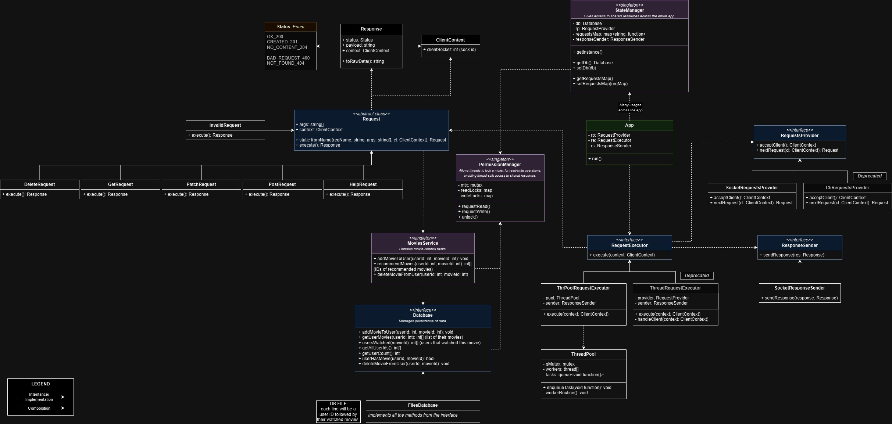

# project-netflix

_Avi Ben David, Kfir Eitan, Eden Shaked_

Advanced Programming project - Netflix App.

###### _(UML below)_

### Answers to the reflection questions in the assignment:

- The renaming of commands doesn't require us to change the current implementation. We just had to rename the relevant
  classes and change the request names in the request map.
- The addition of new commands doesn't require us to change the current code, as we had the Request interface; We just
  added classes that implement it. However, the "split" of the Add request does require us to change the current code
  because the functionality changed - there is in face no more request that does what the Add request did.
- The change of the output of the requests doesn't require us to change the requests themselves, but just the Status
  field of the Response they returned. We already used a Status enum for status codes, just not the ones that the
  assignment requires now, so the change was minor.
- The fact that the I/O is via sockets instead of CMD just required us to create new classes that implement the
  RequestProvider (input) and ResponseSender (output) interfaces. Existing code remained untouched. However, the
  addition of the multithreading does require us to change a bit in the App code - to call the RequestExecutor interface
  we introduced that handles the **way** that requests are executed. That way, we won't have to touch closed code
  later (for example when we'll switch to thread-pool...), we'll just create a new class that implements
  RequestExecutor.
- In addition, we introduced a new interface called ResponseSender that handles the sending of responses. In part 1, we
  had just one print line, so we didn't feel the need for such interface, but now the code is capable of any sending
  method of responses (sockets or anything else). Also, we had the Database interface from part 1 that makes our code
  ready for when we'll switch to a real database. As we said, we'll just create a new class implementing the interface,
  other parts of the code that uses the database will continue using it normally.

## Important Links

- [GitHub (This repo)](https://github.com/Roky360/project-netflix)
- [Jira](https://edenshkd.atlassian.net/jira/software/projects/NP/boards/2/backlog)

---

## How to Run

### Run with Docker

To run the app with Docker, you need to have **Docker Desktop** installed, and to **clone** the repo with:

```
git clone https://github.com/Roky360/project-netflix.git
```

### Run the server

> #### To build and run the app, run:
>
> ```bash
> docker-compose up app
> ```
>
> Then to use the terminal to interact with the app, run (you may need to open another terminal):
>
> ```bash
> docker attach project-netflix-app-1
> ```
>
> Finally, to stop the app, run:
>
> ```bash
> docker stop project-netflix-app-1
> ```
>

> #### To run the unit-tests, run:
> ```bash
> docker-compose up test
> ```

### Run the client

> To build and run the client, run (still in the project's root directory):
> ```bash
> docker-compose up client
> ```

---

## Available Commands

Right now, the server supports these commands:

* ### POST

  Marks movie(s) as watched by a user that **doesn't exist** yet.

  > **POST** user-id [movie-id-1] [movie-id-2] ...

  **Example: `POST 1 101 102 103 110`**

* ### PATCH

  Marks movie(s) as watched by a user that **already exists**.

  > **PATCH** user-id [movie-id-1] [movie-id-2] ...

  **Example: `PATCH 1 101 102 103 110`**

* ### GET

  Recommends to a user up to 10 movies similar to a given movie, based on other users' taste. The user has to be
  registered.

  > **GET** [user-id] [movie-id]

  **Example: `GET 1 108`**

* ### DELETE

  Marks movie(s) as unwatched by a certain users. The user has to be registered and the movie(s) has to be marked as
  watched before this request.

  > **DELETE** [user-id] [movie-id]

  **Example: `DELETE 1 101 103 102`**

* ### Help

  Displays all the available commands.

  > **help**

---

## UML

Here is a UML class diagram of the server.



---


